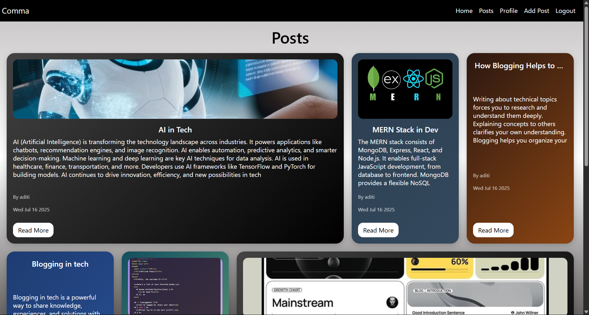

# Comma

[🌐 View the Live App](https://comma-7rlz.onrender.com/)

🚀 A modern, full-stack social platform for sharing posts, comments, and connecting with others. Built with Node.js, Express, MongoDB, EJS, and Cloudinary. 

---

## Features

- 📝 Create, edit, and delete posts
- 💬 Comment on posts
- 🔒 User authentication (register/login/logout)
- 🖼️ Profile management with avatars
- ☁️ Image uploads via Cloudinary
- 🕵️‍♂️ Secure sessions with MongoDB store
- 🎨 Beautiful, responsive Bento UI

---

## Tech Stack

- **Backend:** Node.js, Express, MongoDB (Mongoose), Passport.js
- **Frontend:** EJS templates, CSS (Bento style)
- **File Uploads:** Multer, Cloudinary
- **Session Store:** connect-mongo

---

## Getting Started

1. **Clone the repo:**
   ```bash
   git clone https://github.com/yourusername/comma.git
   cd comma
   ```
2. **Install dependencies:**
   ```bash
   npm install
   ```
3. **Set up your `.env` file:**
   ```env
   MONGO_URI=your_mongodb_connection_string
   CLOUDINARY_CLOUD_NAME=your_cloud_name
   CLOUDINARY_API_KEY=your_api_key
   CLOUDINARY_API_SECRET=your_api_secret
   ```
4. **Run locally:**
   ```bash
   npm start
   ```
5. **Visit:** [http://localhost:5000](http://localhost:5000)

---

## Deployment (Render)

- Push your code to GitHub.
- Create a new Web Service on [Render](https://render.com/).
- Add your environment variables in the Render dashboard.
- Set build command: `npm install`
- Set start command: `npm start`
- Make sure your MongoDB Atlas allows access from Render (IP whitelist: `0.0.0.0/0` for testing).

---

## Folder Structure

```
Comma/
├── app.js
├── package.json
├── .env
├── public/
│   ├── images/
│   └── styles/
├── models/
├── controllers/
├── routes/
├── views/
│   └── partials/
├── config/
├── middlewares/
└── utils/
```

---


## Screenshots

### Home Page


### Post Details


---

## Contributing

Pull requests are welcome! For major changes, please open an issue first to discuss what you would like to change.

---

## License

[ISC](LICENSE)

---

## Author

Made with ❤️ by aditi0403
